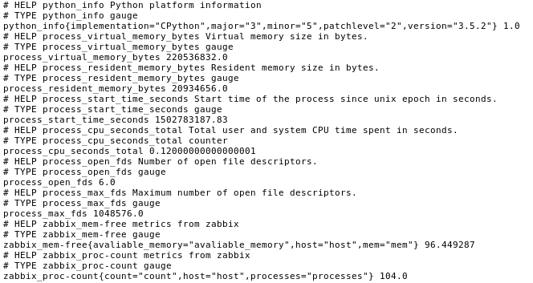
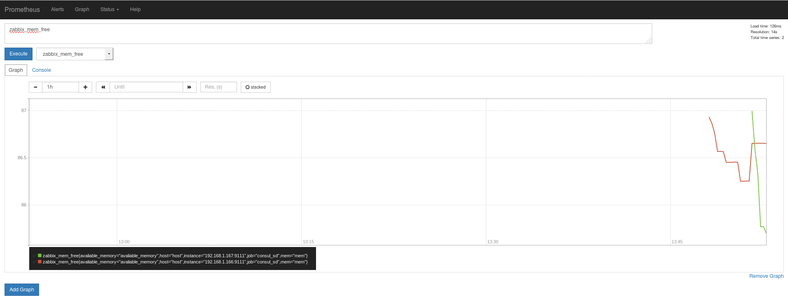

# PROMETHEUS SWISS KNIFE EXPORTER

Quick universal exporter. It is quick not because it works fast but because You can add monitoring metric in 2 minutes. But if needed, you can substitute any special exporter, with `swiss_knife_exporter`.

## Why it might be usefull?
1. You can add temporary metric. And it will not take more than 5 minutes.
2. Cannot find special exporter for something you need to monitor.
3. Use only one exporter for everything. In case you know what data you need.

## Dependencies
* PYyaml
* prometheus_client
* zabbix_agent (Optional. if useZabbix=true)

`#pip3 install prometheus_client pyyaml`

## How it works
For thouse who is not familiar with zabbix. Zabbix it is a server and an agent. The Server polls agents with some interval. The agent supports a default list of metrics(https://www.zabbix.com/documentation/3.0/manual/config/items/itemtypes/zabbix_agent), and can be extended with custom metrics (https://www.zabbix.com/documentation/3.0/manual/config/items/userparameters?s%5B%5D=userparameter). So we will use only the agent (no server).
At this point we have a source of metrics, very powerful and flexible source. `Prometheus` server uses an HTTP connection to get metrics. So literally speaking prometheus is a HTTP client and an export is a HTTP server. `swiss_knife_exporter` is a server which gets metrics from `zabbix_agent` and supply them to prometheus server.

In some special cases it is possible to run swiss_knife_exporter solo - without zabbix_agent. To do this, `useZabbix` option should set to false and `metric` should contain either shell command (using pipe is also possible) or path to shell script.

`exporter_config.yml` contains information how to connect to zabbix_agent and information about metrics. Native config format for promethus is YAML. So exporter_config.yml uses yaml as well.
All fields are mandatory.

```
---
zabbix_config:
  host: ...
  port: ...
  socket_timeout: ...
exporter_config:
  exporter_port: ...
  syslog: False or True
  useZabbix: False or True
metrics:
  -
    name: ...
    metric: vm.memory.size[pavailable]
    ^ OR V
    metric: "cat /proc/cpuinfo | grep processor | wc -l"
    labels: []
```



By default `swiss_knife_exporter` looks for `exporter_config.yml` in:
* /etc/prometheus_swiss_knife_exporter/
* ~/.exporter_config.yml
* in folder with `swiss_knife_exporter.py`

## DEMO
You can try it by vagrant up https://github.com/pymag09/local_env/tree/master/consul_prometheus
